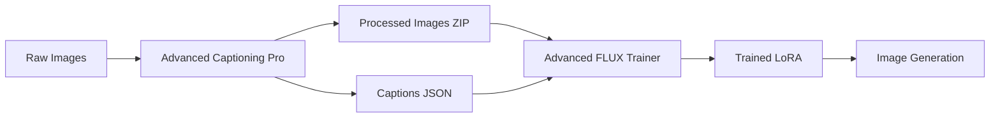

# 🔄 Complete AI Workflow: Captioning → Training → Generation

This guide shows the complete workflow from image captioning to LoRA training to final image generation.

## 📋 Workflow Overview



## 🎯 Step-by-Step Guide

### Phase 1: Image Preparation & Captioning

#### 1.1 Prepare Your Images
```bash
# Create a ZIP file with your images
# Supported formats: JPG, JPEG, PNG, WebP, BMP, TIFF, GIF
zip my_images.zip *.jpg *.png
```

#### 1.2 Generate Captions
```bash
# Navigate to captioning directory
cd /workspace/Lora_Trainer_Imgen_Flux/joy-caption-alpha-two-vqa-test-one

# Activate virtual environment
source ../venv/bin/activate

# Launch Advanced Captioning Pro
python3 advanced_captioning_pro.py
```

**Captioning Process:**
1. Upload your ZIP file
2. Enter descriptive prompt: `"Describe this image in detail, focusing on style, mood, and composition"`
3. Adjust settings if needed:
   - Temperature: 0.7 (balanced creativity)
   - Top-p: 0.9 (good diversity)
   - Max tokens: 1024 (detailed captions)
   - Batch size: 4-8 (GPU dependent)
4. Click "Start Advanced Processing"
5. Download 3 files:
   - `folder_captions.txt` (human-readable)
   - `folder_captions.json` (structured data)
   - `folder_processed_images.zip` (renamed PNGs)

### Phase 2: LoRA Training

#### 2.1 Launch Advanced Trainer
```bash
# Navigate to ai-toolkit directory  
cd /workspace/Lora_Trainer_Imgen_Flux/ai-toolkit

# Activate virtual environment (if not already active)
source ../venv/bin/activate

# Launch Advanced FLUX Trainer
./launch_advanced_trainer.sh
```

#### 2.2 Configure Training
1. **Upload Files:**
   - Processed Images ZIP (from captioning)
   - Captions JSON (from captioning)

2. **Load Dataset:**
   - Click "Load Dataset"
   - Review dataset statistics
   - Verify image-caption matching

3. **Configure Training:**
   ```yaml
   LoRA Name: "my-style-lora"
   Trigger Word: "MYSTYLE"
   Steps: 1000
   Learning Rate: 4e-4
   LoRA Rank: 16
   Model: dev (for quality)
   Low VRAM: true (if <24GB GPU)
   ```

4. **Sample Prompts (Optional):**
   ```
   Sample 1: "A portrait MYSTYLE, professional lighting"
   Sample 2: "A landscape in MYSTYLE aesthetic"  
   Sample 3: "An artistic composition MYSTYLE"
   ```

5. **Start Training:**
   - Click "Start Advanced Training"
   - Monitor progress in real-time
   - Training typically takes 30-60 minutes

### Phase 3: Model Usage

#### 3.1 Access Trained Model
```bash
# Local model location
ls ../output/my-style-lora/

# Hugging Face model (if uploaded)
# https://huggingface.co/username/my-style-lora
```

#### 3.2 Use with ComfyUI
1. Copy LoRA file to ComfyUI models directory
2. Load in LoRA loader node
3. Set strength: 0.8-1.2
4. Include trigger word in prompts

#### 3.3 Use with Automatic1111
1. Place LoRA in `models/Lora/` directory
2. Use syntax: `<lora:my-style-lora:1.0>`
3. Include trigger word in prompts

## 🎨 Example Workflow

### Complete Example: Portrait Style Training

#### Step 1: Caption Generation
**Input:** 20 portrait photos
**Prompt:** `"Describe this portrait in detail, including lighting, mood, pose, and artistic style"`
**Output:** 
- 20 PNG images (0001.png to 0020.png)
- Detailed captions with artistic descriptions

#### Step 2: LoRA Training  
**Configuration:**
```yaml
LoRA Name: "artistic-portrait-style"
Trigger: "ARTPORT"
Steps: 1200
Learning Rate: 3e-4
Rank: 20
Samples: [
  "A professional headshot ARTPORT, studio lighting",
  "A dramatic portrait ARTPORT, chiaroscuro lighting", 
  "A casual portrait ARTPORT, natural lighting"
]
```

#### Step 3: Generation Examples
```python
# Basic usage
prompt = "A portrait of a woman ARTPORT, professional photography"

# Style variations
prompt = "A portrait of a man ARTPORT, dramatic lighting, black and white"
prompt = "A self-portrait ARTPORT, artistic composition, golden hour"
prompt = "A group portrait ARTPORT, family photo, warm lighting"
```

## 🔧 Optimization Tips

### For Best Quality
1. **High-Quality Source Images:**
   - Consistent lighting and style
   - Good composition and clarity
   - Representative of desired output

2. **Detailed Captions:**
   - Describe style elements specifically
   - Include mood and atmosphere
   - Mention technical aspects (lighting, composition)

3. **Training Parameters:**
   - Use 1200-1500 steps for style training
   - Higher rank (20-32) for complex styles
   - Lower learning rate (2e-4 to 3e-4) for stability

### For Faster Training
1. **Streamlined Dataset:**
   - 10-15 representative images
   - Consistent style and quality
   - Clear, concise captions

2. **Optimized Settings:**
   - 800-1000 steps
   - Standard rank (16)
   - Enable Low VRAM mode
   - Use FLUX.1-schnell for speed

### For Memory Efficiency
1. **GPU Optimization:**
   - Enable Low VRAM mode
   - Reduce batch size to 1
   - Lower LoRA rank (8-12)
   - Use gradient checkpointing

2. **Dataset Management:**
   - Limit to 20-30 images max
   - Resize images to 1024x1024
   - Use efficient image formats

## 📊 Quality Assessment

### Evaluation Criteria
1. **Style Consistency:** Does the LoRA reproduce the target style?
2. **Trigger Responsiveness:** Does the trigger word activate the style?
3. **Flexibility:** Can it work with different subjects and compositions?
4. **Artifact Level:** Are there unwanted artifacts or distortions?

### Improvement Strategies
1. **Low Quality:** Increase steps, improve dataset
2. **Inconsistent:** Better captions, more diverse training data
3. **Overfitted:** Lower learning rate, more regularization
4. **Underfitted:** Higher rank, more steps, higher learning rate

## 🚀 Advanced Workflows

### Multi-Style Training
Train multiple related styles and combine them:
```python
# Use multiple LoRAs together
prompt = "A portrait <lora:style1:0.7> <lora:style2:0.3> MYSTYLE"
```

### Progressive Training
Start with basic style, then refine:
1. Train base style (1000 steps)
2. Fine-tune specific aspects (500 steps)
3. Polish details (300 steps)

### Dataset Augmentation
Enhance your training data:
1. Generate variations with existing models
2. Use different captioning prompts
3. Include style-related metadata

## 📈 Performance Monitoring

### Training Metrics
- **Loss Convergence:** Should decrease steadily
- **Sample Quality:** Progressive improvement
- **Memory Usage:** Stable throughout training
- **Training Speed:** Consistent steps/second

### Quality Metrics  
- **Style Accuracy:** Visual similarity to training data
- **Prompt Adherence:** Responds to text descriptions
- **Artifact Level:** Minimal unwanted effects
- **Versatility:** Works across different scenarios

## 🎯 Success Examples

### Character/Portrait LoRAs
- **Dataset:** 15-25 consistent character images
- **Captions:** Focus on features, expressions, poses
- **Training:** 1200 steps, rank 24, lr 3e-4
- **Usage:** Character generation, style transfer

### Artistic Style LoRAs  
- **Dataset:** 20-30 artwork images
- **Captions:** Emphasize technique, mood, composition
- **Training:** 1000 steps, rank 16, lr 4e-4
- **Usage:** Style application, artistic effects

### Product/Object LoRAs
- **Dataset:** 10-20 product variations
- **Captions:** Technical details, materials, context
- **Training:** 800 steps, rank 12, lr 5e-4
- **Usage:** Product visualization, variations

## 🔄 Continuous Improvement

### Iterative Refinement
1. **Train Initial Model:** Basic parameters
2. **Test & Evaluate:** Generate samples
3. **Identify Issues:** Quality problems
4. **Adjust Parameters:** Refine training
5. **Retrain:** Improved version

### Community Learning
- Share successful configurations
- Learn from others' experiences
- Contribute to documentation
- Report bugs and improvements

---

**This complete workflow enables professional-quality LoRA creation with minimal manual effort. Happy training! 🎨**